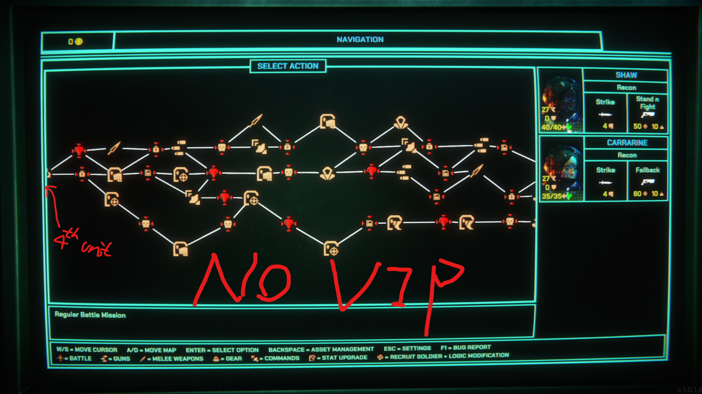

# XenopurgeNoRescue

No more rescue missions after you get your 4th squad unit! Everyone™ hates that!

A MelonLoader mod for Xenopurge.

## Features

- Removes rescue missions after you have 4 squad units.

## Requirements

- [MelonLoader](https://melonloader.co/)

## Installation

Skip to step 2 if you already have MelonLoader installed.

1. Install MelonLoader
    a. `<game_directory>` is the directory where the game executable is located. For example, `C:\Program Files (x86)\Steam\steamapps\common\Xenopurge`. If you still cannot find it, right-click the game in your Steam library, select "Manage", then "Browse local files".
2. Place the mod DLL in `<game_directory>/Mods/`
3. Restart the game

## Usage

Just play the game as normal. The mod works automatically.

## Notes

- Mac users: MelonLoader only supports Windows and Linux. Wait for Steam Workshop support.
- Xenopurge uses Mono, not IL2CPP.
